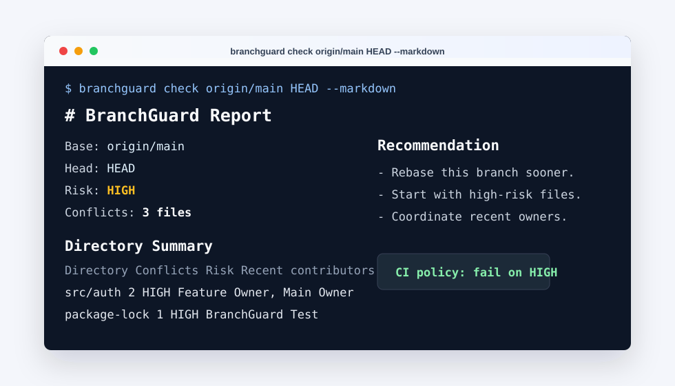

# BranchGuard

[](https://www.npmjs.com/package/branchguard-cli)
[](https://www.npmjs.com/package/branchguard-cli)
[](./LICENSE)

> 合并前提前发现 Git 冲突，给小团队用的轻量 CLI / GitHub Action。

[English README](./README.en.md)

BranchGuard 回答一个很具体的问题：

> 这个分支合到 `main` 之前，会不会冲突？冲突在哪里？风险高不高？该找谁协调？

它适合 5-20 人研发小团队、外包团队、多分支并行开发团队，以及不想为了冲突预检安装重型 Git GUI 的开发者。

当前版本：`v0.3.0` 已发布到 npm。实现是零运行时依赖的 Node.js CLI，默认只读，不创建 merge commit，不改分支，不写 Git index，也不上传代码。



## 快速开始

全局安装：

```bash
npm install --global branchguard-cli
branchguard doctor
```

在 Git 仓库里运行：

```bash
branchguard init
branchguard check main feature/login
branchguard check main feature/login --markdown
branchguard check main feature/login --html --output branchguard-report.html
branchguard matrix --base main
```

也可以直接从 GitHub 安装：

```bash
npm install --global github:wonderly321/branchguard-cli
branchguard doctor
```

## 它解决什么

小团队常见问题不是“不知道怎么解决冲突”，而是冲突发现太晚：

- PR 快合并时才发现一堆冲突。
- 多个 feature 分支互相压着，谁先合都可能炸。
- 新人、外包、并行需求多时，冲突责任人不好找。
- IDE 内置工具好用，但 CI 和跨仓库协作不够直接。

BranchGuard 的定位是提前预警：

- 本地一行命令检查两个 ref 是否会冲突。
- CI 里自动检查 PR。
- 只让 `HIGH` 风险冲突阻塞合并，普通冲突先提醒。
- 生成 Markdown / HTML / JSON 报告。
- 给出目录风险摘要和最近贡献者提示。

## 命令

### `doctor`

检查 Git 是否可用、当前目录是否是 Git 仓库、Git 版本是否支持所需能力。

```bash
branchguard doctor
```

### `init`

生成默认配置文件 `.branchguard.json`。

```bash
branchguard init
branchguard init --force
```

### `check`

检查两个 ref 是否可以干净合并。

```bash
branchguard check <base> <head>
```

示例：

```bash
branchguard check main feature/login
branchguard check origin/main HEAD --json
branchguard check origin/main HEAD --markdown
branchguard check origin/main HEAD --html --output branchguard-report.html
```

退出码：

- `0`：检查成功，无冲突。
- `1`：命令或环境错误，例如不是 Git 仓库、ref 不存在。
- `2`：检查成功，但发现冲突。

### `matrix`

检查多个本地分支相对某个 base 的冲突矩阵。

```bash
branchguard matrix --base main
branchguard matrix --base main --limit 20
branchguard matrix --base main --markdown
branchguard matrix --base main --html --output branchguard-matrix.html
```

## 输出格式

默认输出人类可读文本，也支持 JSON、Markdown、HTML：

```bash
branchguard check main feature/login --json
branchguard check main feature/login --markdown
branchguard check main feature/login --html --output branchguard-report.html
```

`--output <file>` 会把同一份报告写入文件，父目录会自动创建。

报告包含：

- 冲突文件列表。
- `LOW` / `MEDIUM` / `HIGH` 风险等级。
- 按目录聚合的风险摘要。
- 基于 `git log` 的最近贡献者提示。
- 被配置忽略的冲突数量。

HTML 报告是单文件内联 CSS，适合作为 CI artifact 上传。

## GitHub Action

PR 冲突检查示例：

```yaml
name: BranchGuard

on:
  pull_request:
    branches:
      - main

permissions:
  contents: read
  issues: write
  pull-requests: read

jobs:
  conflict-check:
    runs-on: ubuntu-latest
    steps:
      - uses: actions/checkout@v6
        with:
          fetch-depth: 0

      - uses: wonderly321/branchguard-cli@v0.3.0
        with:
          base: origin/main
          head: HEAD
          format: markdown
          fail-on-risk: high
          comment: "true"
          github-token: ${{ github.token }}
```

`fail-on-risk` 支持：

- `any`：有冲突就失败。
- `high`：只在高风险冲突时失败。
- `never`：只报告，不阻塞 CI。

`comment: "true"` 会在 PR 下创建或更新一条 BranchGuard 评论。

仓库里已经有真实 workflow 示例：[.github/workflows/branchguard.yml](./.github/workflows/branchguard.yml)。

## 每周冲突报告

可以定时生成分支冲突矩阵，并上传 HTML artifact：

```yaml
- uses: wonderly321/branchguard-cli@v0.3.0
  with:
    mode: matrix
    base: origin/main
    limit: 20
    format: html
    output: branchguard-weekly-report.html
    fail-on-risk: high

- uses: actions/upload-artifact@v7
  if: always()
  with:
    name: branchguard-weekly-report
    path: branchguard-weekly-report.html
```

完整示例：[docs/examples/github-weekly-report.yml](./docs/examples/github-weekly-report.yml)。

## 团队通知

GitHub Action 支持通用 webhook、飞书、钉钉：

```yaml
- uses: wonderly321/branchguard-cli@v0.3.0
  with:
    base: origin/main
    head: HEAD
    format: markdown
    fail-on-risk: high
    webhook-url: ${{ secrets.BRANCHGUARD_WEBHOOK_URL }}
    webhook-provider: feishu
    webhook-on: high
```

`webhook-provider` 支持：

- `generic`
- `feishu`
- `dingtalk`

`webhook-on` 支持：

- `conflict`
- `high`
- `always`
- `never`

webhook 发送失败默认不阻塞 CI。如需阻塞，可设置：

```yaml
webhook-fail-on-error: "true"
```

## 风险等级

- `LOW`：没有冲突。
- `MEDIUM`：一两个普通文件冲突。
- `HIGH`：三个及以上冲突，或命中高风险文件。

默认高风险文件包括：

- lock files：`package-lock.json`、`pnpm-lock.yaml`、`yarn.lock`、`Cargo.lock` 等。
- migration：`db/migrations/**`、`migrations/**`。
- schema / OpenAPI / GraphQL / proto 文件。

目录风险会根据目录下冲突数量和高风险文件聚合。

## 配置

创建配置：

```bash
branchguard init
```

默认 `.branchguard.json`：

```json
{
  "highRiskPatterns": [
    "package-lock.json",
    "pnpm-lock.yaml",
    "yarn.lock",
    "Cargo.lock",
    "go.sum",
    "composer.lock",
    "db/migrations/**",
    "migrations/**",
    "schema/**",
    "openapi/**",
    "**/*.proto",
    "**/*.graphql"
  ],
  "ignorePatterns": [
    "dist/**",
    "coverage/**",
    "node_modules/**"
  ]
}
```

`highRiskPatterns` 用于把匹配文件标为 `HIGH`。

`ignorePatterns` 用于忽略非行动项冲突。如果所有冲突都被忽略，BranchGuard 返回 `0`，JSON 里仍会保留 `ignored_conflict_count`。

## 设计原则

BranchGuard 是只读工具：

- 不创建 merge commit。
- 不切换分支。
- 不写 Git index。
- 不上传代码。
- 不依赖云服务。

在新版本 Git 上优先使用 `git merge-tree --write-tree`。在 Git 2.37 这类旧版本上，会回退解析旧版 `git merge-tree <base-tree> <branch1> <branch2>` 输出。

## 文档

- [产品路线图](./docs/product-roadmap.md)
- [v0.3.0 发布说明](./docs/releases/v0.3.0.md)
- [v0.2.0 发布说明](./docs/releases/v0.2.0.md)
- [v0.1.0 发布说明](./docs/releases/v0.1.0.md)
- [发布清单](./docs/release-checklist.md)
- [npm 发布指南](./docs/npm-publish.md)
- [SDD 文档](./docs/sdd)

## 适合谁

BranchGuard 现在最适合：

- 每周都遇到 Git 冲突的小团队。
- 多分支并行开发的业务团队。
- 想在 PR 阶段提前发现风险的 Tech Lead。
- 想要一个轻量、透明、可放进 CI 的 Git 冲突预检工具的人。
